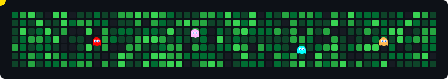

<h1 align="center">I'm Riya Prashant Mandaogade</h1>
<h5 align="center">Full-Stack Developer | ML Enthusiast | AWS Certified — from Mumbai</h5>

  

  

### 🛠️ About Me

- 🎓 B.Tech CSE @ VIT Bhopal (2022–2026)
- 🏆 AWS Certified Cloud Practitioner
- 📈 **Fun Fact:** I find markets as fascinating as algorithms
- 🔗 **Portfolio:** [Coming Soon]

---

### 🌐 Connect With Me

---
### 💻 Tech Stack

**Languages**

**Frameworks & Libraries**

**Databases**

**Tools & Cloud**

## 📊 GitHub Stats:

  
  &nbsp;
  

  

